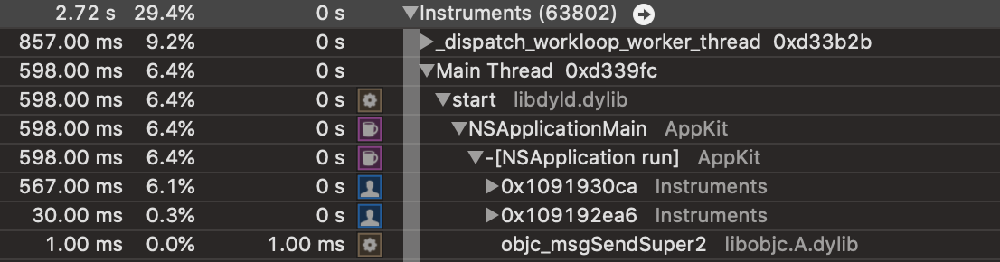

# Treevolve Vision

## Motivation

I was inspired to puruse this while trying to fix a bug in [dmd](https://dlang.org).  I was trying to understand how the AST the compiler produced was changing over time.  The current tools in DMD for this are conditionally compiled printfs that log which functions are being called, and running dmd in LLDB.  I found both to be difficult to work with due to the deluge of information provided (and minor annoyance at how many places in DMD I needed to adjust to actually get the logging I wanted), and the fact that it was a "one-shot" process.  My process was:

* Enable some printfs
* Rebuild dmd
* Open it in lldb
* Add a breakpoint
* Run it
* Examine the printf output + backtrace data from lldb

I believe the following workflow would have been much easier to use:

* Enable AST event logging to a file
* Open a GUI tool for viewing the log data (I think a tool that turns the log file into a single static web page is the way to go here)
* Examine the AST by scrubbing back/forth over time, and filtering by nodes of interest.

Logging to a file and doing the filtering at analysis time means we can enable ALL logging without worrying about spamming my terminal with stuff I don't care about.  

I think this approach will be valuable for debugging and understanding any evolving tree data (or almost-tree-like graphs).

## Overview

Treevolve will consist of a data format for tree log data and a script that turns a log into a static webpage that allows exploration of the log.  Any application that dumps events in treevolve format can use its vizualitation features.

### Log format

Some thoughts:

* Tree nodes will consist of a unique ID (for DMD, I think using the node address will work since the GC is disabled), a list of child nodes, and maybe the other fields stored in the node (it's type or other member variables)
* Event types: 
    * Node created
    * Node added to its parent
    * Node removed from a parent
    * (Lower priority) Node data updated

The events would refer to nodes using the unique IDs.

The file format should be be easy to generate (so probably text based), and should not require "finalization."  ie, if the generating program crashes, the in-progress file should be a valid input.  This means that JSON won't work out of the box because we'd need to add `]}` at the end.  Having each log entry be in JSON format, but not the whole file seems doable, but it would require a json parser that can read one object from the file, and advance the input, which the major stdlib ones for JS and D don't seem to do.

### Visualizer

As mentioned, the tool should produce a self contained static web page (probably inlining the style and js too) to make it really easy to use.

Features I want:

* A visualization of the tree.  I think just a nested list where children can be expanded on click will be fine, and is a good simple place to start.  Not sure what the name is, but what instruments uses for showing nesting in function calls. 
* Filtering by subtree (show me only events/nodes that are in the subtree rooted at a given node).  Possibly also filtering by some other aspect of the event
* scrubbing through time, with a time slider, plus a list of all the events you can click on/scroll through.  Highlighting the change in the tree visualization may be helpful
* Some sort of "node search" to help with subtree based filtering

#### Implementation considerations

For each node, I think we want a map of its set of all-time descendants for doing filtering, and probably a list of all events that affect it.  For the filtered view, we probably want to union the events for all involved nodes.

For scrubbing, keeping the currently visualized tree up to date may be tricky.  Starting with just running all events as they happen (or undoing them to go backwards) and then being more clever if necessary seems like the way to go.  Node value updates seem like they'll be the trickiest part to handle.

I think this will work for graphs with loops as long as we don't do any sort of auto expanding/tree based algorithms.  Highlighting a loop would be useful (like coloring a node that's present at 2 levels of the visualization with the same color).

## Future plans

I'll start experimenting by creating and adding adequate logging a JSON parser using my [autoparsed library](https://github.com/benjones/autoparsed).

If that works well, I'll push to incorporate this logging into DMD and evaluate it on a bigger project like that.  I think it can be added incrementally by just logging some events in treevolve format and adding more as necessary.  For example, first adding this to ASTNode constructors/the parse, then adding it to the semantic/optimization passes after that.

